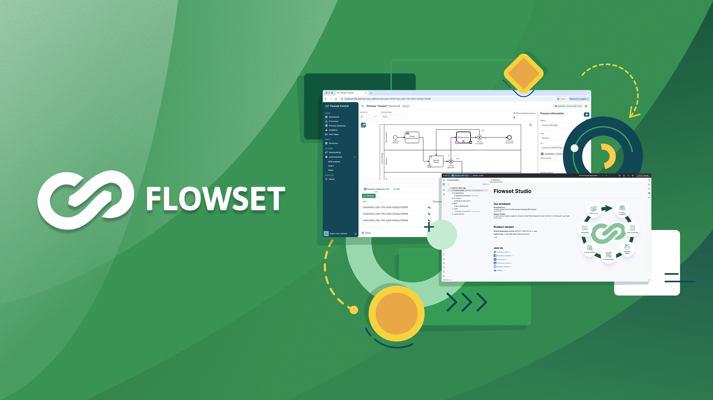

# 🚀 Flowset Studio Community

**A powerful IntelliJ IDEA plugin for BPM Engine development**

---

---

**Flowset Studio Community** is a free IntelliJ IDEA plugin designed for developers working with BPM Engines, including Camunda 7, Operaton, and other compatible BPM engines.

Flowset Studio allows developers to leverage the Java and Spring Boot ecosystem for the development of enterprise applications following the BPMN approach. It provides developers with an all-in-one tool, covering the full lifecycle from modeling to deployment.

**Key Features**
- **Explicit project structure:** Clear organization of BPM-related project components.
- **Navigation between process-related objects:** Seamlessly navigate between processes, services, and delegates.
- **Working with processes locally and remotely:** Manage processes both in your IDE and on remote BPM engines.
- **Smart search:** Quickly find process definitions, tasks, and related code.
- **Business process modeler:** Built-in BPMN 2.0 modeler for designing workflows.
- **Smart code completion and validations:** IntelliJ-powered assistance for BPM-specific code.
- **Services and Java delegates generation:** Auto-generate boilerplate code for service tasks and delegates.

> [!NOTE]
> Currently supports Camunda 7, Operaton, and other BPM engines compatible with the Camunda Rest API.

## Table of Contents

- [Installation](#installation)
- [Purpose of This Repository](#purpose-of-this-repository)
- [Useful Links](#useful-links)

## Installation 

The plugin is available on **[JetBrains Marketplace](https://plugins.jetbrains.com/plugin/25655-flowset)**.

**Installation steps:**
1. Open IntelliJ IDEA.
2. Go to the menu: IntelliJ IDEA → Settings → Plugins.
3. Switch to the Marketplace tab and enter into the search field: _Flowset_.
4. Click **Install** to install the plugin.
5. Restart IntelliJ IDEA to activate it.

More details in the [documentation](https://docs.flowset.io/flowset/studio/setup.html).

## Purpose of This Repository 

This repository is intended for collecting **community issues and feedback** for **Flowset Studio Community**.

> [!IMPORTANT]
> The product source code is **not published** in this repository. This repository is used exclusively for collecting community feedback.

This repository exists to:

- Report bugs
- Suggest new features
- Discuss improvements and UX
- Ask usage-related questions about Flowset Studio Community

## 🔗 Useful Links 

- [Official website](https://flowset.io/studio)
- [JetBrains Marketplace](https://plugins.jetbrains.com/plugin/25655-flowset)
- [Documentation](https://docs.flowset.io/flowset/studio/index.html)
- [Slack community & support](https://flowset-io.slack.com/)